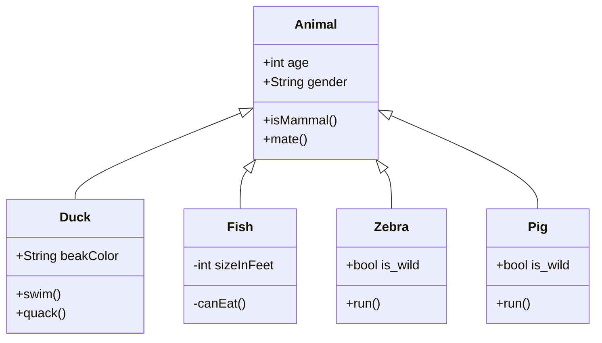
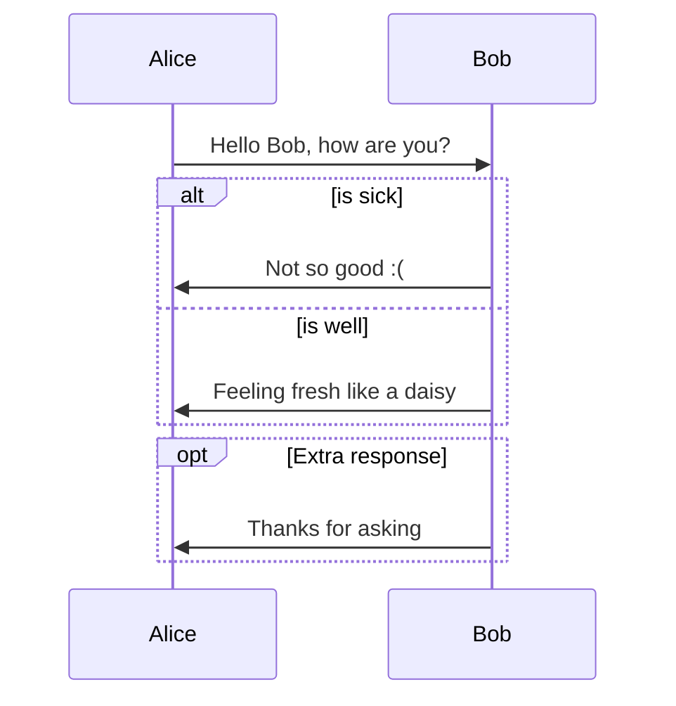

OOP_Perl


 <div class="row">
  <div class="col-md-2 col-md-offset-3">
   <h1>Hello World</h1>
  </div>
 </div>


```python
a, b = 0, 1
 while b < 10:
   print(b)
   a, b = a, a + b
```








~~~flow
```flow
st=>start: Start
op=>operation: Your Operation
cond=>condition: Yes or No?
e=>end

st->op->cond
cond(yes)->e
cond(no)->op
```
~~~


```perl
my $alert_lev = 'alert';
sub curr_alert  {$alert_lev}
sub set_alert   {$alert_lev = $_[1]}
sub get_alert_ord {
  my ($self, $usr_alert) = @_;
  $usr_alert ||= $self->curr_alert(); 
  $tags->{$usr_alert}->[0];
}

sub get_alert_cb {
  my ($self, $usr_alert) = @_;
  $usr_alert ||= $self->curr_alert(); 
  $tags->{$usr_alert}->[1];
}


```

